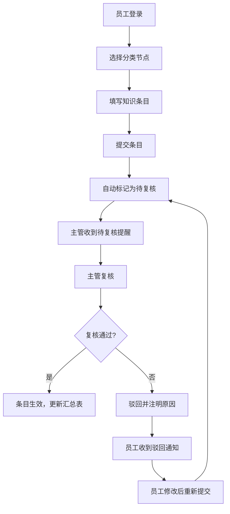
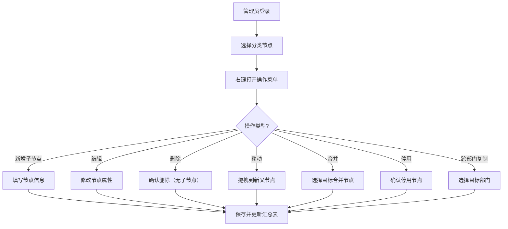
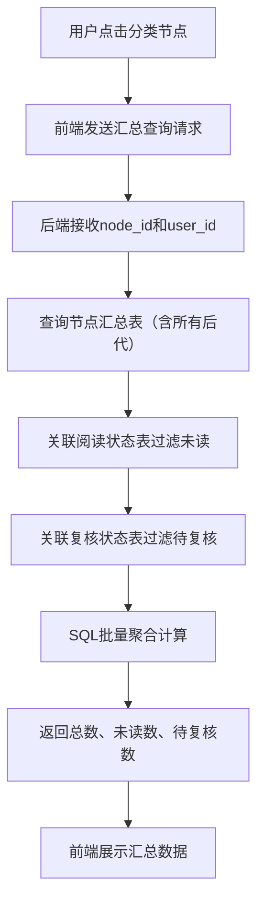

## 1. 产品概述

办公知识分类管理系统是一个面向企业内部的知识管理平台，解决企业知识资产分散、分类混乱、阅读状态不可控、责任归属不清晰等问题。系统通过树形分类结构实现知识的层级化管理，支持多角色权限隔离，确保知识资产的安全、有序和高效利用。

- 核心价值：实现企业知识资产的结构化管理，提高知识检索效率，明确责任归属，跟踪阅读状态
- 目标用户：企业管理员、普通员工、部门主管

## 2. 核心功能

### 2.1 用户角色

| 角色 | 注册方式 | 核心权限 |
|------|---------|----------|
| 管理员 | 系统预置 | 维护分类树结构（增删改、移动、合并、停用、跨部门复制）、管理权限范围、管理责任小组 |
| 员工 | 系统预置 | 提交知识条目、更新阅读状态、查看知识列表、按分类筛选 |
| 主管 | 系统预置 | 复核知识条目分类归属、导出知识清单、查看待复核条目、查看汇总统计 |

### 2.2 功能模块

1. **登录模块**：角色分离登录、权限验证、会话管理
2. **分类树管理**：树形结构展示、增删改节点、拖拽移动、合并节点、停用节点、跨部门复制
3. **知识条目管理**：提交条目、编辑条目、条目列表展示、分类筛选
4. **阅读状态管理**：标记已读/未读、阅读状态汇总
5. **复核管理**：待复核列表、复核通过/驳回、分类调整
6. **汇总统计**：节点汇总查询（总数、未读、待复核）、导出Excel
7. **责任小组管理**：小组创建、成员管理、权限分配

### 2.3 页面详情

| 页面名称 | 模块名称 | 功能描述 |
|---------|---------|----------|
| 登录页 | 登录模块 | 角色选择、账号密码登录、错误提示 |
| 管理员首页 | 分类树管理 | 树形结构展示、右键菜单操作、节点汇总数据 |
| 管理员-分类树 | 分类树管理 | 节点增删改、拖拽移动、合并、停用、复制操作面板 |
| 管理员-责任小组 | 责任小组管理 | 小组列表、成员管理、权限范围配置 |
| 员工首页 | 知识条目管理 | 知识列表、分类树筛选、提交新条目 |
| 员工-我的知识 | 知识条目管理 | 已提交的知识条目、编辑/删除操作 |
| 员工-阅读记录 | 阅读状态管理 | 阅读历史、未读条目提醒 |
| 主管首页 | 复核管理 | 待复核列表、汇总统计、快捷操作 |
| 主管-复核中心 | 复核管理 | 批量复核、分类调整、复核记录 |
| 主管-数据导出 | 导出功能 | 按条件筛选、导出Excel清单 |

## 3. 核心流程

### 3.1 知识条目提交与审核流程

### 3.2 分类树节点操作流程

### 3.3 节点汇总查询流程

## 4. 用户界面设计

### 4.1 设计风格

- **主色调**：专业蓝色系 `#165DFF`（主色）、`#4080FF`（辅色）、`#0E42D2`（深色）
- **辅助色**：成功绿 `#00B42A`、警告橙 `#FF7D00`、危险红 `#F53F3F`
- **中性色**：`#1D2129`（标题）、`#4E5969`（正文）、`#C9CDD4`（边框）、`#F2F3F5`（背景）
- **按钮风格**：圆角4px、hover时背景加深10%、点击时添加内阴影
- **字体**：标题使用 `PingFang SC Semibold`、正文使用 `PingFang SC Regular`
- **布局风格**：左侧导航+右侧内容区的经典后台布局，顶部固定用户信息栏
- **图标风格**：使用Ant Design Vue图标库，线性风格，统一16px/20px尺寸

### 4.2 页面设计概述

| 页面名称 | 模块名称 | UI元素 |
|---------|---------|--------|
| 登录页 | 登录模块 | 居中卡片式布局、角色切换Tab、表单输入框、登录按钮、品牌Logo、渐变背景 |
| 管理员首页 | 分类树管理 | 左侧树形面板（带右键菜单）、右侧汇总统计卡片、操作工具栏、拖拽提示 |
| 分类树管理 | 分类树管理 | 树形结构（支持展开/折叠）、节点标签（显示状态标识）、拖拽高亮、操作确认弹窗 |
| 员工首页 | 知识条目管理 | 左侧分类筛选树、右侧条目列表（卡片式）、搜索框、新建按钮、阅读状态标记 |
| 主管首页 | 复核管理 | 顶部统计仪表盘（待复核数、已通过数、驳回数）、待复核列表、快捷复核按钮 |
| 复核中心 | 复核管理 | 列表式布局、批量选择、复核操作栏、分类调整下拉框、备注输入 |

### 4.3 交互细节

- **树形节点**：hover时显示操作按钮，选中高亮，拖拽时显示放置指示器
- **右键菜单**：点击右键弹出操作菜单，包含新增、编辑、删除、移动、合并、停用、复制等选项
- **汇总数据**：点击节点后右侧面板平滑过渡展示汇总卡片，数字带动画效果
- **阅读状态**：未读条目显示红点标记，点击后平滑消失，同步更新汇总数
- **复核操作**：批量选择后出现浮动操作栏，支持一键通过/驳回

### 4.4 响应式设计

- **桌面端优先**：针对1920×1080及以上分辨率优化
- **平板适配**：1024px-1440px，调整侧边栏宽度，优化列表列数
- **移动端**：768px以下，侧边栏改为抽屉式，列表改为单列卡片布局
- **触摸优化**：按钮最小尺寸44px×44px，支持触摸滑动操作

### 4.5 动画效果

- **页面加载**：顶部进度条 + 内容区淡入（300ms）
- **树形展开/折叠**：高度过渡 + 旋转图标（200ms ease-out）
- **汇总数字**：数字滚动动画（500ms）
- **操作反馈**：按钮点击缩放（100ms）、成功提示滑入（200ms）
- **拖拽效果**：节点半透明跟随，目标区域高亮边框
