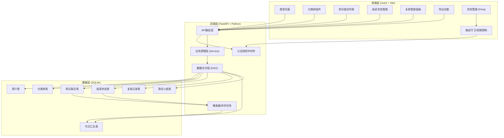
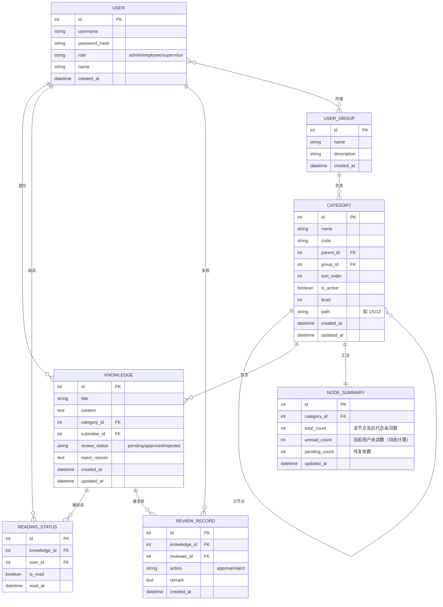

## 1. 架构设计



## 2. 技术描述

### 2.1 前端技术栈
- **框架**: Vue 3.4+ (Composition API)
- **构建工具**: Vite 5.0+
- **状态管理**: Pinia 2.1+
- **路由**: Vue Router 4.2+
- **UI组件库**: Ant Design Vue 4.1+
- **树形组件**: 自定义实现 + ant-design-vue Tree
- **拖拽库**: vuedraggable@next 或原生HTML5拖拽API
- **HTTP客户端**: Axios 1.6+
- **Excel导出**: xlsx 0.18+
- **端口**: 8079

### 2.2 后端技术栈
- **框架**: FastAPI 0.109+
- **Python版本**: 3.10+
- **数据库驱动**: aiosqlite (异步) 或 sqlite3
- **ORM**: SQLAlchemy 2.0+ (异步模式)
- **数据验证**: Pydantic 2.6+
- **认证**: JWT (python-jose[cryptography])
- **密码加密**: passlib[bcrypt]
- **异步任务**: APScheduler 或 SQLite触发器
- **CORS**: fastapi.middleware.cors
- **端口**: 8009

### 2.3 数据库
- **SQLite 3** (文件存储，便于部署)
- **核心设计**: 节点汇总表 + 触发器实现高性能递归查询

## 3. 目录结构

### 3.1 后端目录结构
```
backend/
├── app/
│   ├── main.py              # FastAPI入口，配置CORS、路由、端口8009
│   ├── config.py            # 配置文件（数据库、JWT、端口等）
│   ├── database.py          # 数据库连接、会话管理
│   ├── models/              # SQLAlchemy数据模型
│   │   ├── __init__.py
│   │   ├── user.py          # 用户模型
│   │   ├── category.py      # 分类树模型
│   │   ├── knowledge.py     # 知识条目模型
│   │   ├── reading.py       # 阅读状态模型
│   │   ├── review.py        # 复核记录模型
│   │   ├── summary.py       # 节点汇总模型
│   │   └── group.py         # 责任小组模型
│   ├── schemas/             # Pydantic请求/响应模型
│   │   ├── __init__.py
│   │   ├── user.py
│   │   ├── category.py
│   │   ├── knowledge.py
│   │   ├── reading.py
│   │   ├── review.py
│   │   ├── summary.py
│   │   └── common.py
│   ├── api/                 # API路由
│   │   ├── __init__.py
│   │   ├── auth.py          # 认证接口
│   │   ├── categories.py    # 分类树CRUD + 移动/合并/复制
│   │   ├── knowledge.py     # 知识条目接口
│   │   ├── reading.py       # 阅读状态接口
│   │   ├── review.py        # 复核接口
│   │   ├── summary.py       # 汇总查询接口
│   │   └── groups.py        # 责任小组接口
│   ├── services/            # 业务逻辑层
│   │   ├── __init__.py
│   │   ├── category_service.py
│   │   ├── knowledge_service.py
│   │   ├── reading_service.py
│   │   ├── review_service.py
│   │   ├── summary_service.py
│   │   └── auth_service.py
│   ├── middleware/          # 中间件
│   │   ├── __init__.py
│   │   └── auth.py          # JWT认证中间件
│   ├── triggers/            # 数据库触发器SQL
│   │   ├── __init__.py
│   │   └── summary_triggers.sql
│   └── utils/               # 工具函数
│       ├── __init__.py
│       ├── security.py      # JWT、密码工具
│       └── export.py        # Excel导出工具
├── requirements.txt         # Python依赖
├── init_db.py               # 数据库初始化脚本
└── run.py                   # 启动脚本
```

### 3.2 前端目录结构
```
frontend/
├── public/
│   └── favicon.ico
├── src/
│   ├── main.js              # 入口文件
│   ├── App.vue              # 根组件
│   ├── router/              # 路由配置
│   │   └── index.js         # 路由定义、权限守卫
│   ├── stores/              # Pinia状态管理
│   │   ├── user.js          # 用户状态
│   │   ├── category.js      # 分类树状态
│   │   └── knowledge.js     # 知识条目状态
│   ├── api/                 # API接口封装
│   │   ├── request.js       # Axios实例配置
│   │   ├── auth.js          # 认证接口
│   │   ├── category.js      # 分类树接口
│   │   ├── knowledge.js     # 知识条目接口
│   │   ├── reading.js       # 阅读状态接口
│   │   ├── review.js        # 复核接口
│   │   └── summary.js       # 汇总查询接口
│   ├── components/          # 公共组件
│   │   ├── CategoryTree/    # 分类树组件
│   │   │   ├── index.vue    # 树形组件主文件
│   │   │   ├── TreeNode.vue # 单节点组件
│   │   │   └── ContextMenu.vue # 右键菜单
│   │   ├── Layout/          # 布局组件
│   │   │   ├── MainLayout.vue
│   │   │   ├── Sidebar.vue
│   │   │   └── Header.vue
│   │   └── common/          # 通用组件
│   │       └── StatusBadge.vue
│   ├── views/               # 页面组件
│   │   ├── Login.vue        # 登录页
│   │   ├── admin/           # 管理员页面
│   │   │   ├── CategoryManage.vue
│   │   │   └── GroupManage.vue
│   │   ├── employee/        # 员工页面
│   │   │   ├── KnowledgeList.vue
│   │   │   ├── MyKnowledge.vue
│   │   │   └── ReadingHistory.vue
│   │   └── supervisor/      # 主管页面
│   │       ├── ReviewCenter.vue
│   │       ├── Dashboard.vue
│   │       └── Export.vue
│   ├── utils/               # 工具函数
│   │   ├── auth.js          # 认证工具
│   │   ├── tree.js          # 树形数据处理
│   │   └── export.js        # 导出工具
│   ├── styles/              # 全局样式
│   │   ├── index.css
│   │   └── variables.css    # CSS变量
│   └── permission.js        # 权限控制
├── vite.config.js           # Vite配置（端口8079）
├── package.json
└── index.html
```

## 4. 路由定义

### 4.1 前端路由
| 路由路径 | 页面组件 | 角色权限 | 说明 |
|---------|---------|---------|------|
| `/login` | Login.vue | 所有 | 登录页面 |
| `/` | 重定向到对应首页 | - | 根据角色跳转 |
| `/admin/categories` | admin/CategoryManage.vue | 管理员 | 分类树管理 |
| `/admin/groups` | admin/GroupManage.vue | 管理员 | 责任小组管理 |
| `/employee/knowledge` | employee/KnowledgeList.vue | 员工 | 知识列表 |
| `/employee/my-knowledge` | employee/MyKnowledge.vue | 员工 | 我的知识 |
| `/employee/reading` | employee/ReadingHistory.vue | 员工 | 阅读记录 |
| `/supervisor/dashboard` | supervisor/Dashboard.vue | 主管 | 数据概览 |
| `/supervisor/review` | supervisor/ReviewCenter.vue | 主管 | 复核中心 |
| `/supervisor/export` | supervisor/Export.vue | 主管 | 数据导出 |

### 4.2 后端API路由

#### 认证接口
| 方法 | 路径 | 说明 |
|-----|------|------|
| POST | `/api/auth/login` | 登录，返回JWT token |
| POST | `/api/auth/logout` | 登出 |
| GET | `/api/auth/me` | 获取当前用户信息 |

#### 分类树接口
| 方法 | 路径 | 说明 |
|-----|------|------|
| GET | `/api/categories` | 获取全部分类树 |
| GET | `/api/categories/{id}` | 获取单个节点详情 |
| POST | `/api/categories` | 新增节点 |
| PUT | `/api/categories/{id}` | 更新节点 |
| DELETE | `/api/categories/{id}` | 删除节点（无子节点时） |
| POST | `/api/categories/{id}/move` | 移动节点到新父节点 |
| POST | `/api/categories/{id}/merge` | 合并到目标节点 |
| POST | `/api/categories/{id}/copy` | 跨部门复制节点 |
| POST | `/api/categories/{id}/deactivate` | 停用节点 |

#### 知识条目接口
| 方法 | 路径 | 说明 |
|-----|------|------|
| GET | `/api/knowledge` | 获取知识列表（支持分类筛选） |
| GET | `/api/knowledge/{id}` | 获取知识详情 |
| POST | `/api/knowledge` | 提交新知识条目 |
| PUT | `/api/knowledge/{id}` | 更新知识条目 |
| DELETE | `/api/knowledge/{id}` | 删除知识条目 |

#### 阅读状态接口
| 方法 | 路径 | 说明 |
|-----|------|------|
| POST | `/api/reading/{knowledge_id}` | 标记为已读 |
| DELETE | `/api/reading/{knowledge_id}` | 标记为未读 |
| GET | `/api/reading/my-status` | 获取我的阅读状态列表 |

#### 复核接口
| 方法 | 路径 | 说明 |
|-----|------|------|
| GET | `/api/review/pending` | 获取待复核列表 |
| POST | `/api/review/{knowledge_id}/approve` | 复核通过 |
| POST | `/api/review/{knowledge_id}/reject` | 复核驳回 |
| POST | `/api/review/batch-approve` | 批量通过 |
| POST | `/api/review/batch-reject` | 批量驳回 |

#### 汇总查询接口
| 方法 | 路径 | 说明 |
|-----|------|------|
| GET | `/api/summary/node/{node_id}` | 获取节点汇总（总数、未读、待复核） |
| GET | `/api/summary/all-nodes` | 批量获取所有节点汇总 |

#### 导出接口
| 方法 | 路径 | 说明 |
|-----|------|------|
| GET | `/api/export/knowledge` | 导出知识清单Excel |

#### 责任小组接口
| 方法 | 路径 | 说明 |
|-----|------|------|
| GET | `/api/groups` | 获取小组列表 |
| POST | `/api/groups` | 创建小组 |
| PUT | `/api/groups/{id}` | 更新小组 |
| DELETE | `/api/groups/{id}` | 删除小组 |
| POST | `/api/groups/{id}/members` | 添加成员 |
| DELETE | `/api/groups/{id}/members/{user_id}` | 移除成员 |

## 5. 数据模型

### 5.1 ER图



### 5.2 DDL语句

```sql
-- 用户表
CREATE TABLE users (
    id INTEGER PRIMARY KEY AUTOINCREMENT,
    username VARCHAR(50) UNIQUE NOT NULL,
    password_hash VARCHAR(255) NOT NULL,
    role VARCHAR(20) NOT NULL CHECK (role IN ('admin', 'employee', 'supervisor')),
    name VARCHAR(100) NOT NULL,
    created_at DATETIME DEFAULT CURRENT_TIMESTAMP
);

-- 责任小组表
CREATE TABLE user_groups (
    id INTEGER PRIMARY KEY AUTOINCREMENT,
    name VARCHAR(100) NOT NULL,
    description TEXT,
    created_at DATETIME DEFAULT CURRENT_TIMESTAMP
);

-- 小组成员关联表
CREATE TABLE group_members (
    id INTEGER PRIMARY KEY AUTOINCREMENT,
    group_id INTEGER NOT NULL,
    user_id INTEGER NOT NULL,
    created_at DATETIME DEFAULT CURRENT_TIMESTAMP,
    FOREIGN KEY (group_id) REFERENCES user_groups(id),
    FOREIGN KEY (user_id) REFERENCES users(id),
    UNIQUE(group_id, user_id)
);

-- 分类树表
CREATE TABLE categories (
    id INTEGER PRIMARY KEY AUTOINCREMENT,
    name VARCHAR(100) NOT NULL,
    code VARCHAR(50),
    parent_id INTEGER,
    group_id INTEGER,
    sort_order INTEGER DEFAULT 0,
    is_active BOOLEAN DEFAULT 1,
    level INTEGER DEFAULT 1,
    path VARCHAR(500) DEFAULT '',
    created_at DATETIME DEFAULT CURRENT_TIMESTAMP,
    updated_at DATETIME DEFAULT CURRENT_TIMESTAMP,
    FOREIGN KEY (parent_id) REFERENCES categories(id),
    FOREIGN KEY (group_id) REFERENCES user_groups(id)
);

-- 知识条目表
CREATE TABLE knowledge (
    id INTEGER PRIMARY KEY AUTOINCREMENT,
    title VARCHAR(255) NOT NULL,
    content TEXT NOT NULL,
    category_id INTEGER NOT NULL,
    submitter_id INTEGER NOT NULL,
    review_status VARCHAR(20) DEFAULT 'pending' CHECK (review_status IN ('pending', 'approved', 'rejected')),
    reject_reason TEXT,
    created_at DATETIME DEFAULT CURRENT_TIMESTAMP,
    updated_at DATETIME DEFAULT CURRENT_TIMESTAMP,
    FOREIGN KEY (category_id) REFERENCES categories(id),
    FOREIGN KEY (submitter_id) REFERENCES users(id)
);

-- 阅读状态表
CREATE TABLE reading_status (
    id INTEGER PRIMARY KEY AUTOINCREMENT,
    knowledge_id INTEGER NOT NULL,
    user_id INTEGER NOT NULL,
    is_read BOOLEAN DEFAULT 1,
    read_at DATETIME DEFAULT CURRENT_TIMESTAMP,
    FOREIGN KEY (knowledge_id) REFERENCES knowledge(id),
    FOREIGN KEY (user_id) REFERENCES users(id),
    UNIQUE(knowledge_id, user_id)
);

-- 复核记录表
CREATE TABLE review_records (
    id INTEGER PRIMARY KEY AUTOINCREMENT,
    knowledge_id INTEGER NOT NULL,
    reviewer_id INTEGER NOT NULL,
    action VARCHAR(20) NOT NULL CHECK (action IN ('approve', 'reject')),
    remark TEXT,
    created_at DATETIME DEFAULT CURRENT_TIMESTAMP,
    FOREIGN KEY (knowledge_id) REFERENCES knowledge(id),
    FOREIGN KEY (reviewer_id) REFERENCES users(id)
);

-- 节点汇总表（核心性能优化表）
CREATE TABLE node_summaries (
    id INTEGER PRIMARY KEY AUTOINCREMENT,
    category_id INTEGER UNIQUE NOT NULL,
    total_count INTEGER DEFAULT 0,
    pending_count INTEGER DEFAULT 0,
    updated_at DATETIME DEFAULT CURRENT_TIMESTAMP,
    FOREIGN KEY (category_id) REFERENCES categories(id)
);

-- 索引优化
CREATE INDEX idx_categories_parent_id ON categories(parent_id);
CREATE INDEX idx_categories_path ON categories(path);
CREATE INDEX idx_categories_group_id ON categories(group_id);
CREATE INDEX idx_knowledge_category_id ON knowledge(category_id);
CREATE INDEX idx_knowledge_submitter_id ON knowledge(submitter_id);
CREATE INDEX idx_knowledge_review_status ON knowledge(review_status);
CREATE INDEX idx_reading_status_knowledge_user ON reading_status(knowledge_id, user_id);
CREATE INDEX idx_reading_status_user_id ON reading_status(user_id);
```

### 5.3 节点汇总表触发器（核心性能优化）

```sql
-- 当知识条目变化时，更新所有祖先节点的汇总表
CREATE TRIGGER IF NOT EXISTS trigger_knowledge_update_summary
AFTER INSERT ON knowledge
FOR EACH ROW
BEGIN
    -- 直接节点 + 所有祖先节点都需要更新
    WITH RECURSIVE ancestors(id) AS (
        SELECT NEW.category_id
        UNION ALL
        SELECT c.parent_id FROM categories c
        INNER JOIN ancestors a ON c.id = a.id
        WHERE c.parent_id IS NOT NULL
    )
    INSERT INTO node_summaries (category_id, total_count, pending_count, updated_at)
    SELECT 
        a.id,
        (SELECT COUNT(*) FROM knowledge k 
         INNER JOIN categories c ON k.category_id = c.id 
         WHERE (c.id = a.id OR c.path LIKE (SELECT path FROM categories WHERE id = a.id) || '/%')
         AND k.review_status != 'rejected'),
        (SELECT COUNT(*) FROM knowledge k 
         INNER JOIN categories c ON k.category_id = c.id 
         WHERE (c.id = a.id OR c.path LIKE (SELECT path FROM categories WHERE id = a.id) || '/%')
         AND k.review_status = 'pending'),
        CURRENT_TIMESTAMP
    FROM ancestors a
    WHERE a.id IS NOT NULL
    ON CONFLICT(category_id) DO UPDATE SET
        total_count = excluded.total_count,
        pending_count = excluded.pending_count,
        updated_at = CURRENT_TIMESTAMP;
END;

-- 知识条目更新时触发
CREATE TRIGGER IF NOT EXISTS trigger_knowledge_update_summary_update
AFTER UPDATE ON knowledge
FOR EACH ROW
BEGIN
    -- 更新旧分类的所有祖先
    WITH RECURSIVE ancestors(id) AS (
        SELECT OLD.category_id
        UNION ALL
        SELECT c.parent_id FROM categories c
        INNER JOIN ancestors a ON c.id = a.id
        WHERE c.parent_id IS NOT NULL
    )
    INSERT INTO node_summaries (category_id, total_count, pending_count, updated_at)
    SELECT 
        a.id,
        (SELECT COUNT(*) FROM knowledge k 
         INNER JOIN categories c ON k.category_id = c.id 
         WHERE (c.id = a.id OR c.path LIKE (SELECT path FROM categories WHERE id = a.id) || '/%')
         AND k.review_status != 'rejected'),
        (SELECT COUNT(*) FROM knowledge k 
         INNER JOIN categories c ON k.category_id = c.id 
         WHERE (c.id = a.id OR c.path LIKE (SELECT path FROM categories WHERE id = a.id) || '/%')
         AND k.review_status = 'pending'),
        CURRENT_TIMESTAMP
    FROM ancestors a
    WHERE a.id IS NOT NULL
    ON CONFLICT(category_id) DO UPDATE SET
        total_count = excluded.total_count,
        pending_count = excluded.pending_count,
        updated_at = CURRENT_TIMESTAMP;

    -- 如果分类变化，更新新分类的所有祖先
    UPDATE node_summaries SET
        total_count = (SELECT COUNT(*) FROM knowledge k 
                      INNER JOIN categories c ON k.category_id = c.id 
                      WHERE (c.id = node_summaries.category_id OR c.path LIKE (SELECT path FROM categories WHERE id = node_summaries.category_id) || '/%')
                      AND k.review_status != 'rejected'),
        pending_count = (SELECT COUNT(*) FROM knowledge k 
                        INNER JOIN categories c ON k.category_id = c.id 
                        WHERE (c.id = node_summaries.category_id OR c.path LIKE (SELECT path FROM categories WHERE id = node_summaries.category_id) || '/%')
                        AND k.review_status = 'pending'),
        updated_at = CURRENT_TIMESTAMP
    WHERE category_id IN (
        WITH RECURSIVE ancestors(id) AS (
            SELECT NEW.category_id
            UNION ALL
            SELECT c.parent_id FROM categories c
            INNER JOIN ancestors a ON c.id = a.id
            WHERE c.parent_id IS NOT NULL
        )
        SELECT id FROM ancestors WHERE id IS NOT NULL
    );
END;

-- 知识条目删除时触发
CREATE TRIGGER IF NOT EXISTS trigger_knowledge_update_summary_delete
AFTER DELETE ON knowledge
FOR EACH ROW
BEGIN
    WITH RECURSIVE ancestors(id) AS (
        SELECT OLD.category_id
        UNION ALL
        SELECT c.parent_id FROM categories c
        INNER JOIN ancestors a ON c.id = a.id
        WHERE c.parent_id IS NOT NULL
    )
    INSERT INTO node_summaries (category_id, total_count, pending_count, updated_at)
    SELECT 
        a.id,
        (SELECT COUNT(*) FROM knowledge k 
         INNER JOIN categories c ON k.category_id = c.id 
         WHERE (c.id = a.id OR c.path LIKE (SELECT path FROM categories WHERE id = a.id) || '/%')
         AND k.review_status != 'rejected'),
        (SELECT COUNT(*) FROM knowledge k 
         INNER JOIN categories c ON k.category_id = c.id 
         WHERE (c.id = a.id OR c.path LIKE (SELECT path FROM categories WHERE id = a.id) || '/%')
         AND k.review_status = 'pending'),
        CURRENT_TIMESTAMP
    FROM ancestors a
    WHERE a.id IS NOT NULL
    ON CONFLICT(category_id) DO UPDATE SET
        total_count = excluded.total_count,
        pending_count = excluded.pending_count,
        updated_at = CURRENT_TIMESTAMP;
END;
```

## 6. 服务器架构


### 6.1 关键技术点说明

1. **递归查询优化**
   - 使用 `path` 字段存储节点路径（如 `1/5/12`），便于快速查询所有后代
   - 预计算 `level` 字段存储节点层级
   - `node_summaries` 汇总表预存每个节点的总数和待复核数
   - SQLite 触发器自动维护汇总表数据一致性
   - 查询时使用 `path LIKE '1/5/%'` 快速获取所有后代，避免递归CTE的性能问题

2. **未读数量动态计算**
   - 未读数与当前用户相关，不适合预存到汇总表
   - 查询时使用 `LEFT JOIN reading_status` + `IS NULL` 批量计算
   - SQL示例：
     ```sql
     SELECT 
         ns.total_count,
         ns.pending_count,
         COUNT(CASE WHEN rs.id IS NULL AND k.review_status != 'rejected' THEN 1 END) as unread_count
     FROM node_summaries ns
     CROSS JOIN categories c
     LEFT JOIN knowledge k ON k.category_id = c.id 
         AND (c.id = :node_id OR c.path LIKE (SELECT path FROM categories WHERE id = :node_id) || '/%')
     LEFT JOIN reading_status rs ON rs.knowledge_id = k.id AND rs.user_id = :user_id
     WHERE ns.category_id = :node_id
     GROUP BY ns.category_id
     ```

3. **节点操作的完整性**
   - 移动节点：更新 `parent_id`、`path`、`level`，并递归更新所有后代的 `path` 和 `level`
   - 合并节点：将源节点下的所有知识条目和子节点移到目标节点，然后删除源节点
   - 停用节点：设置 `is_active = 0`，不影响历史数据，仅在展示时过滤
   - 跨部门复制：递归复制节点及其所有后代到目标部门，重置 `group_id` 和 `path`

## 7. 初始化数据

```python
# 默认用户（密码均为 123456）
users = [
    {"username": "admin", "password": "123456", "role": "admin", "name": "系统管理员"},
    {"username": "employee1", "password": "123456", "role": "employee", "name": "员工张三"},
    {"username": "employee2", "password": "123456", "role": "employee", "name": "员工李四"},
    {"username": "supervisor1", "password": "123456", "role": "supervisor", "name": "主管王五"},
]

# 默认责任小组
groups = [
    {"name": "技术部", "description": "技术研发部门"},
    {"name": "产品部", "description": "产品设计部门"},
    {"name": "运营部", "description": "运营推广部门"},
]

# 默认分类树结构
categories = [
    # 技术部分类
    {"name": "技术文档", "code": "TECH", "parent_id": None, "group_id": 1, "level": 1, "path": "1"},
    {"name": "前端开发", "code": "TECH-FE", "parent_id": 1, "group_id": 1, "level": 2, "path": "1/2"},
    {"name": "后端开发", "code": "TECH-BE", "parent_id": 1, "group_id": 1, "level": 2, "path": "1/3"},
    {"name": "Vue3 规范", "code": "TECH-FE-VUE", "parent_id": 2, "group_id": 1, "level": 3, "path": "1/2/4"},
    # 产品部分类
    {"name": "产品文档", "code": "PROD", "parent_id": None, "group_id": 2, "level": 1, "path": "5"},
    {"name": "需求文档", "code": "PROD-REQ", "parent_id": 5, "group_id": 2, "level": 2, "path": "5/6"},
    {"name": "原型设计", "code": "PROD-PROTO", "parent_id": 5, "group_id": 2, "level": 2, "path": "5/7"},
    # 运营部分类
    {"name": "运营资料", "code": "OPS", "parent_id": None, "group_id": 3, "level": 1, "path": "8"},
    {"name": "活动策划", "code": "OPS-ACT", "parent_id": 8, "group_id": 3, "level": 2, "path": "8/9"},
    {"name": "数据分析", "code": "OPS-DATA", "parent_id": 8, "group_id": 3, "level": 2, "path": "8/10"},
]
```

## 8. 性能优化策略

1. **数据库层**
   - 为所有外键和查询字段建立适当的索引
   - 使用 `path` 字段的前缀匹配替代递归CTE查询
   - 汇总表预计算避免重复聚合
   - 触发器确保数据实时一致性

2. **后端层**
   - 使用 SQLAlchemy 异步查询
   - 接口结果缓存（分类树结构不常变化）
   - 批量查询替代N+1查询

3. **前端层**
   - 树形组件虚拟滚动（大数据量时）
   - 节点数据懒加载
   - 汇总数据缓存
   - 防抖/节流优化频繁操作
